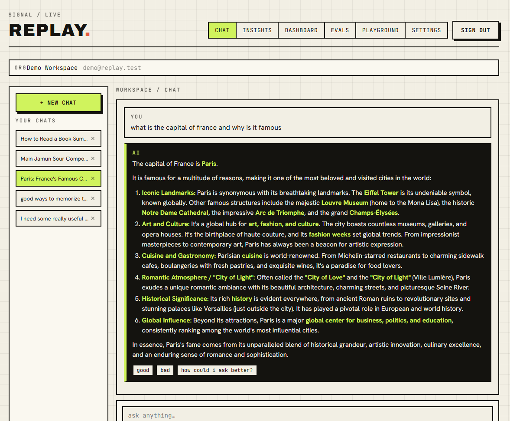
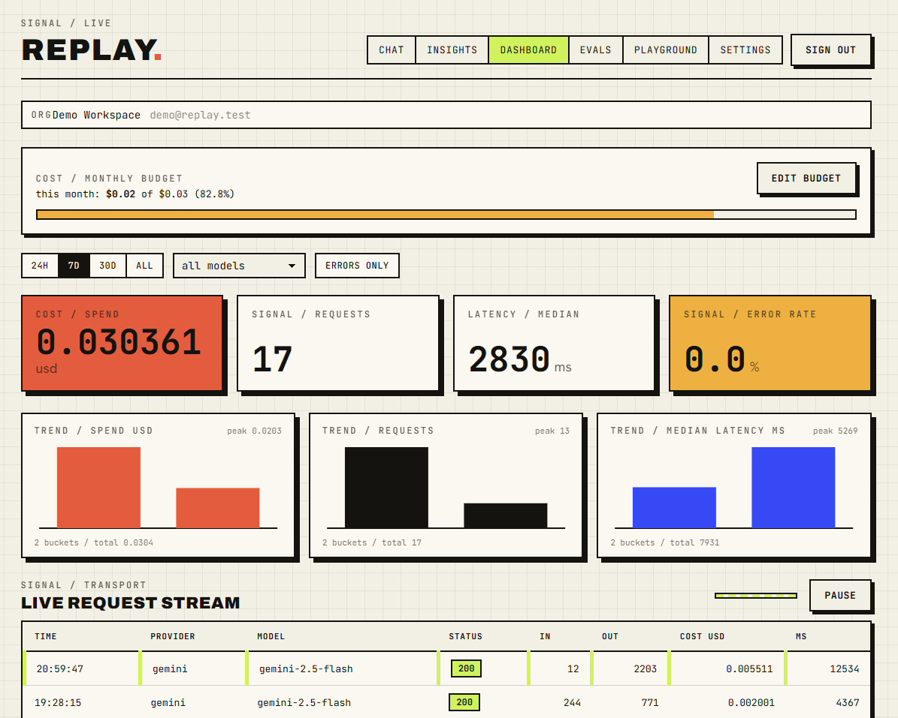
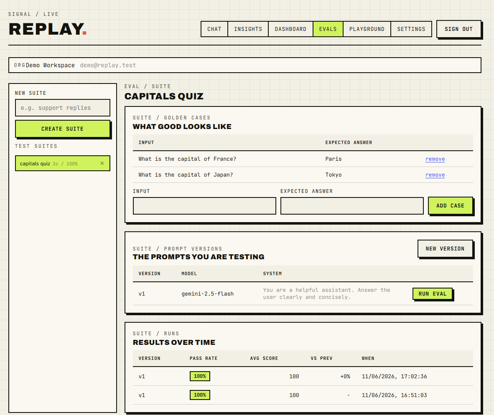
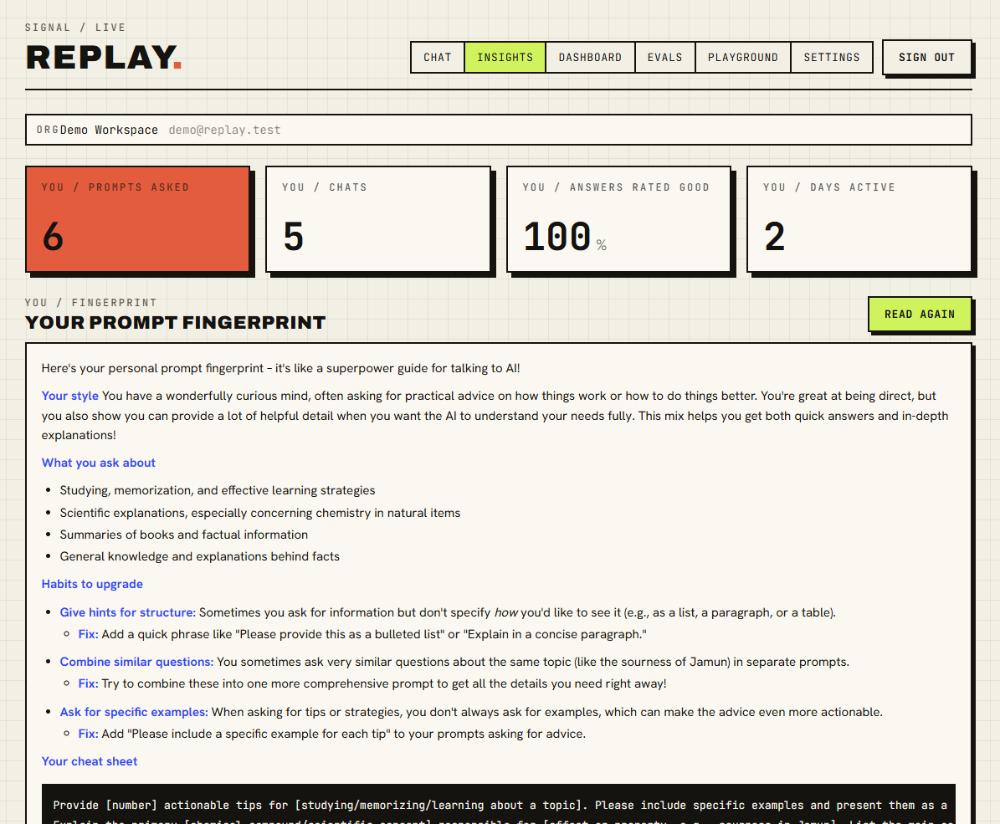

<div align="center">

# REPLAY

### Capture every prompt. Make every next one better.

**Replay** is a multi-tenant LLM **observability and evaluation** platform with a twist:
the proxy that watches your AI traffic is the same engine that *replays* it to make
your prompts better. It works for developers shipping AI features and for everyday
people chatting with AI.

Bring your own key. Runs entirely on free tiers. Costs **$0** to host.

[](LICENSE)


**[Live demo](https://replay-ashen.vercel.app)**

<!-- Add docs/screenshots/hero.png (see docs/screenshots/README.md) -->


</div>

---

## What is Replay?

Most LLM tools make you choose: an **observability** product for developers, or a
**chat** product for users. Replay is both, on one shared engine, because the data
that makes a dashboard is the same data that makes a better prompt.

> **The thesis:** the proxy that observes your traffic is also what captures your eval
> data. Replay it against new prompt versions to catch regressions before they ship.

It opens through **two doors.**

### Door one: a smarter place to chat with AI

For people. A clean chat workspace where Replay quietly coaches you. Stuck on how to
phrase something? One click sharpens your prompt. After every answer, learn how you
could have asked better. Replay learns your style and surfaces when you have asked
something like it before.

### Door two: observability for your AI app

For developers. Change one line, your `base_url`, and Replay captures every call:
tokens, cost, latency, the full prompt and response. Streaming passthrough,
per-tenant isolation, budgets, a live dashboard, and an eval harness. Your provider
key stays encrypted.

---

## Features

### Chat workspace and Prompt Doctor
Multi-turn streaming chat with model picker and auto-titled conversations. **Prompt
Doctor** rewrites a vague prompt into a sharp one; **Autopsy** gives a friendly
critique after any answer so you learn as you go. Save prompts to a reusable library.

<!-- Add docs/screenshots/chat.png -->


### Observability dashboard
Live request stream with spend, latency, error-rate and volume gauges. Filter by time
range, model, and errors. Hand-drawn trend charts for spend, volume, and latency.
Click any request to inspect the full prompt, response, tokens, and cost.

<!-- Add docs/screenshots/dashboard.png -->


### Eval harness, the namesake
Build a **suite** of golden cases (an input and the answer you want). Version your
prompts, run a version, and a Gemini **judge** scores every case 0 to 100 with a
reason. The runs table shows each version's pass rate over time **with the delta
against the previous run**, so a regression is impossible to miss.

<!-- Add docs/screenshots/evals.png -->


### Insights, your prompt fingerprint
Replay reads your recent prompts and writes back a personal profile: your style, your
topics, the habits worth upgrading, and a cheat sheet of prompt templates tailored to
you. Nothing leaves your workspace.

<!-- Add docs/screenshots/insights.png -->


### Budgets and alerts
Set a per-org monthly spend limit with a threshold alert and an optional hard block
that rejects calls once you hit the cap. Crossing a line raises a deduplicated alert
on the dashboard.

### Bring your own key (BYOK)
Your provider key is encrypted at rest (Fernet) and used only to forward your traffic.
Replay never pays for inference, and never sees your key in plaintext after you store it.

---

## The one-line integration

Already using the OpenAI (or Anthropic) SDK? Point `base_url` at Replay and keep your
code exactly as it is. Replay forwards the call with *your* stored provider key and
records everything, including streaming, captured token by token without adding latency.

```python
from openai import OpenAI

client = OpenAI(
    base_url="https://your-replay-host/v1",  # the only change
    api_key="rpl_your_replay_key",           # the Replay key from your dashboard
)

resp = client.chat.completions.create(
    model="gemini-2.5-flash",
    messages=[{"role": "user", "content": "hello"}],
)
```

---

## Architecture

```
  your app / user                  Replay                      provider
  ---------------    base_url     ------------   BYOK key     ------------
  request         -------------->  proxy +     ------------->  Gemini, etc.
  streamed reply  <-------------   dashboard   <-------------  tokens
                                      |
                                      |  tee: forward untouched,
                                      |  capture usage on close
                                      v
                              Postgres (per-org RLS) + pgvector
                              requests, evals, chat, embeddings
```

- **Strict tenant isolation:** every row carries `org_id`; Postgres Row-Level Security
  enforces it at the database, via a dedicated app role that *cannot* bypass RLS.
- **Streaming that does not break:** SSE chunks are forwarded byte for byte while a tee
  reconstructs usage and text, then writes the log in a background task after the stream closes.
- **Learning loop:** user prompts are embedded (pgvector) to detect recurring intent and
  surface "you have asked this before."

---

## Tech stack

| Layer | Tech |
|-------|------|
| **API** | FastAPI, httpx (async, HTTP/2), SQLAlchemy 2.0 async, asyncpg, Alembic |
| **Data** | Postgres with Row-Level Security and pgvector (Supabase free tier) |
| **Auth** | Supabase Auth (ES256 JWT), Google OAuth, email/password |
| **Security** | Fernet-encrypted BYOK vault, SHA-256 hashed API keys |
| **Web** | Vite, React, TypeScript, plain CSS (no UI framework) |
| **Deploy** | Vercel (web), Render (API), all free tier |

---

## Try it

A live demo runs at **[replay-ashen.vercel.app](https://replay-ashen.vercel.app)**.
Sign up with email or Google, or poke around the shared demo workspace:

```
email:    demo@replay.test
password: replaydemo123
```

> The demo workspace has a Gemini free-tier key attached, so chat, playground, and evals
> all work out of the box.

---

## Run it locally

Requires Python 3.12+, Node 18+, and a Postgres database (a free Supabase project works).

```bash
# 1. Backend
python -m uv venv
python -m uv pip install -e ".[dev]"
cp .env.example .env          # set REPLAY_DATABASE_URL, REPLAY_VAULT_KEY, SUPABASE_*

# generate a vault key:
python -c "from cryptography.fernet import Fernet; print(Fernet.generate_key().decode())"

alembic upgrade head          # create the schema (run as a DB owner)
python -m uvicorn replay.api.app:app --reload   # API on :8000

# 2. Frontend (in another terminal)
cd web
npm install
cp .env.example .env          # set VITE_SUPABASE_URL / ANON_KEY / REPLAY_API_URL
npm run dev                   # dashboard on :5173
```

There is also a CLI for the terminal-inclined:

```bash
replay --help                 # login, keys, providers, logs, cost
```

**Quality gates:** `ruff check .`, `mypy src`, `pytest -q`. All green.

---

## Design

Replay wears a deliberate, original visual identity, an **"analog signal laboratory":**
hard edges (zero rounded corners), loud flat color (lime, coral, cobalt, marigold on
paper and ink), hard offset shadows, and monospaced numerals. No soft gradients, no
pill buttons, no em dashes. The full system lives in [`BUILD_PROMPT.md`](BUILD_PROMPT.md).

---

## License

[MIT](LICENSE)
